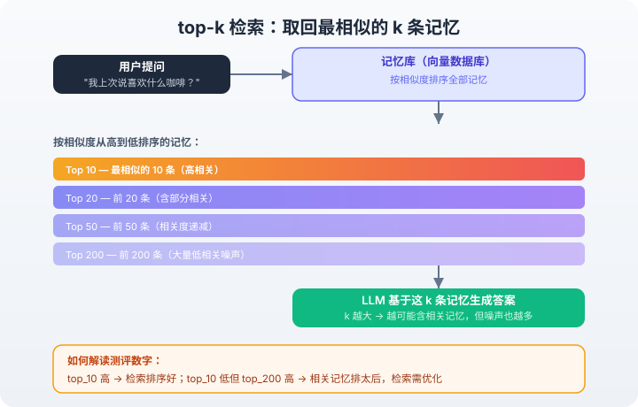
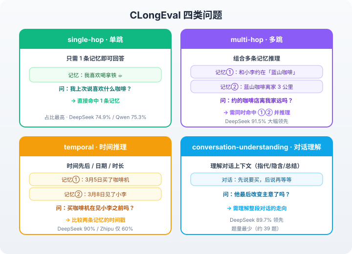

# Memory Benchmarks

Open-source evaluation suite to run benchmarks on memory-augmented LLM systems. Currently supports the [Mem0](https://github.com/mem0ai/mem0) Cloud and OSS versions to measure memory recall, extraction quality, and retrieval accuracy.

## Benchmarks

| Benchmark | Dataset | Questions | What it tests |
|-----------|---------|-----------|---------------|
| **LOCOMO** | 10 multi-session dialogues | ~300 | Factual recall, temporal reasoning, multi-hop inference |
| **LongMemEval** | 500 diverse questions, 6 types | 500 | Long-term memory across information extraction, temporal, and multi-session reasoning |
| **BEAM** | 100 conversations per size bucket (100K–10M tokens) | 2,000+ | Real-world memory retrieval across 10 memory ability types |
| **CLongEval** | 70 conversations, diverse Chinese QA | ~2,800 | Chinese long-term memory: temporal reasoning, multi-hop, entity tracking |

## Quick Start

```bash
git clone https://github.com/mem0ai/memory-benchmarks.git
cd memory-benchmarks
pip install -r requirements.txt
```

### Option A: Mem0 Cloud

No Docker required. You need a [Mem0 API key](https://app.mem0.ai) and an OpenAI API key (for the answerer/judge LLM).

```bash
# Set your keys
export MEM0_API_KEY=m0-your-key
export OPENAI_API_KEY=sk-your-key

# Run a benchmark
python -m benchmarks.locomo.run \
  --project-name my-first-test \
  --backend cloud \
  --mem0-api-key $MEM0_API_KEY

# LongMemEval (500 questions)
python -m benchmarks.longmemeval.run \
  --project-name my-first-test \
  --backend cloud \
  --mem0-api-key $MEM0_API_KEY \
  --all-questions

# BEAM (configurable size)
python -m benchmarks.beam.run \
  --project-name my-first-test \
  --backend cloud \
  --mem0-api-key $MEM0_API_KEY \
  --chat-sizes 100K --conversations 0-9

# CLongEval (Chinese benchmark — 70 conversations)
python -m benchmarks.clongeval.run \
  --project-name my-first-test \
  --backend cloud \
  --mem0-api-key $MEM0_API_KEY \
  --conversations 0
```

### Option B: Mem0 OSS (Self-Hosted)

Requires Docker and Docker Compose. This starts a local Mem0 server backed by Qdrant.

```bash
cp .env.example .env
# Edit .env and add your OPENAI_API_KEY

docker compose up -d
# Mem0 server: http://localhost:8888
# Qdrant:      http://localhost:6333
```

Then run benchmarks against your local server:

```bash
# LOCOMO (fastest — ~300 questions, 10 conversations)
python -m benchmarks.locomo.run --project-name my-first-test

# LongMemEval (500 questions)
python -m benchmarks.longmemeval.run --project-name my-first-test --all-questions

# BEAM (configurable size)
python -m benchmarks.beam.run --project-name my-first-test --chat-sizes 100K --conversations 0-9

# CLongEval (Chinese benchmark — 70 conversations)
python -m benchmarks.clongeval.run --project-name my-first-test --conversations 0
```

By default, the OSS server uses OpenAI for fact extraction (`gpt-4o-mini`) and embeddings (`text-embedding-3-small`). See [Custom Models](#custom-models) for using Azure, Ollama, or other providers.

### View results in the UI

```bash
npm install
npm run dev -- -p 3001
# Open http://localhost:3001
```

The web UI lets you browse results, inspect per-question evaluations with retrieval details, view logs, and compare runs.

## How It Works

Each benchmark script runs a three-stage pipeline:

```
Ingest → Search → Evaluate
```

1. **Ingest**: Conversations are chunked and added to Mem0. The system extracts facts, embeds them, and builds entity links.
2. **Search**: For each question, the system queries Mem0. Results are scored using semantic similarity + BM25 + entity boost.
3. **Evaluate**: An LLM generates an answer from retrieved memories, then a judge LLM scores correctness against ground truth.

## Configuration

### Benchmark options

All benchmarks accept these common flags:

```
--project-name NAME        Run identifier (required)
--answerer-model MODEL     LLM for answer generation (default: gpt-4o)
--judge-model MODEL        LLM for judging (default: gpt-4o)
--provider PROVIDER        LLM provider: openai, anthropic, azure, qwen, zhipu, moonshot (default: openai)
--top-k N                  Retrieved memories count (default: 200)
--top-k-cutoffs LIST       Evaluate at multiple cutoffs (default: 10,20,50,200)
--predict-only             Stop after search, skip answer+judge
--evaluate-only            Skip ingest+search, evaluate existing results
--resume                   Resume from checkpoint
--backend oss|cloud        Mem0 backend (default: oss)
--mem0-host URL            Mem0 server URL (default: http://localhost:8888)
```

### Custom Models

By default, the Mem0 server uses OpenAI for fact extraction (`gpt-4o-mini`) and embeddings (`text-embedding-3-small`). You can change this by mounting a custom config file.

**Step 1**: Copy an example config:

```bash
cp configs/azure-openai.yaml mem0-config.yaml
# or: cp configs/ollama.yaml mem0-config.yaml
```

**Step 2**: Edit `mem0-config.yaml` with your model details.

**Step 3**: Uncomment the volume mount in `docker-compose.yml`:

```yaml
volumes:
  - mem0_history:/app/history
  - ./mem0-config.yaml:/app/config.yaml:ro   # <-- uncomment this line
```

**Step 4**: Restart:

```bash
docker compose down && docker compose up -d
```

See `configs/` for examples:
- `configs/openai.yaml` — OpenAI (default)
- `configs/azure-openai.yaml` — Azure OpenAI
- `configs/ollama.yaml` — Fully local with Ollama (no API keys)
- `configs/qwen.yaml` — Qwen (Alibaba Cloud DashScope, Chinese embedding)
- `configs/zhipu.yaml` — Zhipu AI / GLM (Chinese embedding)
- `configs/moonshot.yaml` — Moonshot / Kimi (Chinese embedding)
- `configs/deepseek.yaml` — DeepSeek (Chinese embedding)

### Chinese LLM Providers

The benchmark supports Chinese domestic LLMs for running CLongEval and other benchmarks with Chinese-optimized models:

| Provider | Env Var | Base URL | Default Model |
|----------|---------|----------|---------------|
| **Qwen** (DashScope) | `DASHSCOPE_API_KEY` or `QWEN_API_KEY` | `https://dashscope.aliyuncs.com/compatible-mode/v1` | `qwen-plus` |
| **Zhipu** (GLM) | `ZHIPU_API_KEY` | `https://open.bigmodel.cn/api/paas/v4` | `glm-4-plus` |
| **Moonshot** (Kimi) | `MOONSHOT_API_KEY` | `https://api.moonshot.cn/v1` | `kimi-k3` |
| **DeepSeek** | `DEEPSEEK_API_KEY` | `https://api.deepseek.com/v1` | `deepseek-chat` |

All four providers use OpenAI-compatible APIs and work with both the answerer/judge LLM and the Mem0 OSS extraction LLM (via config YAML). Chinese embedding models (`BAAI/bge-small-zh-v1.5`) are used by default in their config files.

**Running CLongEval with a Chinese LLM:**

```bash
# Qwen (Alibaba Cloud DashScope)
export DASHSCOPE_API_KEY=sk-your-key
python -m benchmarks.clongeval.run \
  --project-name clongeval-qwen \
  --provider qwen \
  --answerer-model qwen-plus \
  --judge-model qwen-plus \
  --conversations 0

# Zhipu AI (GLM)
export ZHIPU_API_KEY=your-zhipu-key
python -m benchmarks.clongeval.run \
  --project-name clongeval-zhipu \
  --provider zhipu \
  --answerer-model glm-4-plus \
  --judge-model glm-4-plus \
  --conversations 0

# Moonshot AI (Kimi)
export MOONSHOT_API_KEY=your-moonshot-key
python -m benchmarks.clongeval.run \
  --project-name clongeval-moonshot \
  --provider moonshot \
  --answerer-model kimi-k3 \
  --judge-model kimi-k3 \
  --conversations 0

# DeepSeek
export DEEPSEEK_API_KEY=sk-your-key
python -m benchmarks.clongeval.run \
  --project-name clongeval-deepseek \
  --provider deepseek \
  --answerer-model deepseek-chat \
  --judge-model deepseek-chat \
  --conversations 0
```

**Running the full CLongEval test set (all 70 conversations):**

```bash
# Run all 70 conversation groups with Qwen
python -m benchmarks.clongeval.run \
  --project-name clongeval-qwen-full \
  --provider qwen \
  --answerer-model qwen-plus \
  --judge-model qwen-plus \
  --conversations 0-69

# Limit questions per conversation (e.g. first 3 per group)
python -m benchmarks.clongeval.run \
  --project-name clongeval-qwen-3q \
  --provider qwen \
  --answerer-model qwen-plus \
  --judge-model qwen-plus \
  --conversations 0-69 \
  --max-questions 3
```

> **Note on Moonshot rate limits:** the Moonshot API enforces a strict
> organization-level RPM (as low as 3 requests/minute on some plans). When
> running large test sets, pass `--rpm 1` to space requests out and avoid
> repeated 429 errors:
>
> ```bash
> python -m benchmarks.clongeval.run \
>   --project-name clongeval-moonshot-full \
>   --provider moonshot \
>   --answerer-model kimi-k3 \
>   --judge-model kimi-k3 \
>   --conversations 0-69 \
>   --rpm 1
> ```

### CLongEval Dataset

CLongEval is a Chinese long-conversation memory evaluation benchmark with 70 conversation groups and ~2,800 QA pairs testing temporal reasoning, multi-hop inference, and entity tracking in Chinese.

Download the dataset from [CLongEval GitHub](https://github.com/OpenLMLab/CLongEval) and place `small.jsonl` in `datasets/clongeval/`:

```bash
mkdir -p datasets/clongeval
# Download from https://github.com/OpenLMLab/CLongEval
# Place small.jsonl in datasets/clongeval/
```

### Additional Dependencies

The Chinese LLM provider configs (`configs/qwen.yaml`, `configs/zhipu.yaml`, `configs/moonshot.yaml`) use [fastembed](https://github.com/qdrant/fastembed) with `BAAI/bge-small-zh-v1.5` for local Chinese embeddings. Install it with:

```bash
pip install fastembed
```

The benchmark scripts also use [aiolimiter](https://github.com/martinthoma/aiolimiter) for async rate limiting. Install it with:

```bash
pip install aiolimiter
```

Install all benchmark dependencies at once:

```bash
pip install -r requirements.txt fastembed aiolimiter
```

These are only needed when using the Chinese LLM configs for the Mem0 OSS server and running the benchmark scripts. The benchmark scripts themselves have no extra dependencies beyond `requirements.txt`.

### Docker Setup for Chinese CLongEval

To run CLongEval with Chinese extraction and embeddings, the Mem0 OSS server needs a custom config. The `docker-compose.yml` in this repo already mounts `./mem0-config.yaml`:

```yaml
volumes:
  - mem0_history:/app/history
  - ./mem0-config.yaml:/app/config.yaml:ro   # already enabled in this repo
```

**Step 1**: Create `mem0-config.yaml` from a Chinese provider config (this file is gitignored — it holds your API key):

```bash
cp configs/qwen.yaml mem0-config.yaml
# or: cp configs/zhipu.yaml mem0-config.yaml
# or: cp configs/moonshot.yaml mem0-config.yaml
```

**Step 2**: Edit `mem0-config.yaml` and add your API key:

```yaml
llm:
  provider: openai            # Qwen/Zhipu/Moonshot all use OpenAI-compatible APIs
  config:
    model: qwen-plus          # or glm-4-plus / kimi-k3
    temperature: 0.1
    openai_base_url: "https://dashscope.aliyuncs.com/compatible-mode/v1"
    api_key: "your-api-key"   # <-- put your key here

embedder:
  provider: fastembed
  config:
    model: BAAI/bge-small-zh-v1.5
    embedding_dims: 512
```

**Step 3**: Start the server:

```bash
docker compose up -d
# Mem0 server: http://localhost:8888
# Qdrant:      http://localhost:6333
```

**Step 4**: Run the benchmark against the local server:

```bash
python -m benchmarks.clongeval.run \
  --project-name clongeval-qwen \
  --provider qwen \
  --answerer-model qwen-plus \
  --judge-model qwen-plus \
  --conversations 0
```

> **Note:** the Mem0 server uses Qwen for fact extraction (via `mem0-config.yaml`),
> while the benchmark's `--provider`/`--answerer-model`/`--judge-model` control the
> answer-generation and judging LLM. You can mix them (e.g. Qwen extraction +
> Zhipu answerer/judge) to compare models fairly.

## Results

### Mem0 Platform

Results using the Mem0 managed platform with the v3 memory pipeline.

#### LongMemEval

| Metric | Top 200 | Top 50 |
|--------|---------|--------|
| **Overall** | **94.4%** (472/500) | **94.8%** (474/500) |

<details>
<summary>LongMemEval breakdown by question type</summary>

| Question Type | Top 200 | Top 50 |
|---------------|---------|--------|
| knowledge-update | 93.6% (73/78) | 93.6% (73/78) |
| multi-session | 88.0% (117/133) | 93.2% (124/133) |
| single-session-assistant | 98.2% (55/56) | 98.2% (55/56) |
| single-session-preference | 96.7% (29/30) | 93.3% (28/30) |
| single-session-user | 98.6% (69/70) | 98.6% (69/70) |
| temporal-reasoning | 97.0% (129/133) | 94.0% (125/133) |

</details>

#### LoCoMo

| Metric | Top 200 | Top 50 |
|--------|---------|--------|
| **Overall** | **92.5%** (1425/1540) | **91.8%** (1414/1540) |

<details>
<summary>LoCoMo breakdown by question type (avg across top_10/20/50/200)</summary>

| Question Type | Avg (Top 10–200) |
|---------------|------------------|
| single-hop | 91.2% |
| multi-hop | 91.3% |
| open-domain | 72.7% |
| temporal | 92.0% |

</details>

#### BEAM

| Dataset | Top 200 | | Top 50 | |
|---------|---------|---|--------|---|
| | **Pass Rate** | **Avg Score** | **Pass Rate** | **Avg Score** |
| **BEAM 1M** (700 questions) | **70.1%** (491/700) | 0.641 | **67.1%** (470/700) | 0.604 |
| **BEAM 10M** (200 questions) | **50.5%** (101/200) | 0.486 | **45.5%** (91/200) | 0.413 |

<details>
<summary>BEAM breakdown by memory ability type</summary>

**BEAM 1M (Top 200)**

| Ability | Avg Score | Pass Rate |
|---------|-----------|-----------|
| preference_following | 0.883 | 68/70 |
| instruction_following | 0.852 | 62/70 |
| information_extraction | 0.700 | 53/70 |
| multi_session_reasoning | 0.652 | 52/70 |
| knowledge_update | 0.650 | 46/70 |
| summarization | 0.635 | 48/70 |
| temporal_reasoning | 0.618 | 47/70 |
| event_ordering | 0.536 | 42/70 |
| abstention | 0.525 | 39/70 |
| contradiction_resolution | 0.357 | 34/70 |

**BEAM 10M (Top 200)**

| Ability | Avg Score | Pass Rate |
|---------|-----------|-----------|
| preference_following | 0.904 | 19/20 |
| instruction_following | 0.825 | 18/20 |
| knowledge_update | 0.750 | 16/20 |
| information_extraction | 0.562 | 11/20 |
| summarization | 0.469 | 11/20 |
| abstention | 0.400 | 8/20 |
| contradiction_resolution | 0.325 | 5/20 |
| multi_session_reasoning | 0.261 | 6/20 |
| event_ordering | 0.202 | 3/20 |
| temporal_reasoning | 0.163 | 4/20 |

</details>

### OSS with Different Extraction Models

LongMemEval results using the self-hosted Mem0 OSS pipeline with different LLMs for memory extraction. All runs use the same embedder (Qwen 600M via SageMaker), the same Qdrant vector store, and GPT-5 as the answerer and judge.

| Extraction Model | Overall | SS-User | SS-Asst | SS-Pref | Knowledge Update | Temporal Reasoning | Multi-Session |
|-----------------|---------|---------|---------|---------|------------------|-------------------|---------------|
| **GPT-5** | **91.0%** | 95.7% | 92.9% | 93.3% | 91.0% | 94.7% | 83.5% |
| **GPT-OSS-120B** | **89.8%** | 95.7% | 96.4% | 93.3% | 89.5% | 80.5% | 79.7% |
| **Llama 4 Maverick** | **88.6%** | 97.1% | 75.0% | 93.3% | 93.6% | 90.2% | 84.2% |
| **Gemma 4 31B** | **88.6%** | 95.7% | 83.9% | 93.3% | 94.9% | 91.7% | 78.9% |

Full per-question evaluation results are available in [`results/platform/`](results/platform/) and [`results/oss/`](results/oss/).

### CLongEval (Chinese Benchmark)

Full CLongEval results (all 70 conversations, 358 questions) using the self-hosted Mem0 OSS pipeline with Chinese LLMs as the answerer and judge. All runs share the same setup:

- **Mem0 OSS** with the v1.1 algorithm, Qwen (`qwen-plus`) for fact extraction, and `BAAI/bge-small-zh-v1.5` (512-dim) for Chinese embeddings
- Each model is used as both the answerer and the judge for its own run
- Evaluated on the [CLongEval](https://github.com/OpenLMLab/CLongEval) Chinese test set

#### What do Top 10 / 20 / 50 / 200 mean?

These are **retrieval depths** — how many of the most similar memories the system retrieves from the vector store and passes to the LLM when answering a question.

| Parameter | Meaning |
|-----------|---------|
| **Top 10** | Retrieve the 10 most similar memories |
| **Top 20** | Retrieve 20 |
| **Top 50** | Retrieve 50 |
| **Top 200** | Retrieve 200 |



The four numbers reveal **retrieval quality**, not just final accuracy:

- **High Top 10** → relevant memories rank at the top; retrieval ordering is good.
- **Low Top 10 but high Top 200** → relevant memories exist but rank too low; retrieval needs improvement (this is exactly the bottleneck we found — 91–97% of errors come from the relevant memory not making it into the top-k).
- **k is not always better** — too small misses relevant memories, too large introduces noise that can mislead the LLM (e.g. Zhipu drops from 74.9% at Top 50 to 72.3% at Top 200).

#### Overall accuracy by retrieval depth

| Model | Top 10 | Top 20 | **Top 50** | Top 200 |
|-------|--------|--------|-----------|---------|
| **DeepSeek** (`deepseek-chat`) | 70.7% (253/358) | 81.3% (291/358) | **80.7%** (289/358) | 81.3% (291/358) |
| **Qwen** (`qwen-plus`) | 69.8% (250/358) | 78.2% (280/358) | **78.2%** (280/358) | 77.9% (279/358) |
| **Zhipu** (`glm-4-plus`) | 67.0% (240/358) | 73.5% (263/358) | **74.9%** (268/358) | 72.3% (259/358) |

#### What do the question types mean?

CLongEval classifies each of the 358 questions into four types:

| Type | Meaning | Example |
|------|---------|---------|
| **single-hop** | Answerable from a single memory | "What coffee did I say I liked?" |
| **multi-hop** | Requires combining multiple memories and reasoning | "Is the café I booked with Xiao Li far from home?" (find the café, then its distance) |
| **temporal** | Requires reasoning about time order / dates / durations | "Did I buy the coffee machine before or after meeting Xiao Li?" |
| **conversation-understanding** | Requires understanding the whole conversation context (references, implications, summaries) | "Did I change my mind by the end of this conversation?" |



#### Breakdown by question type (Top 50)

| Model | single-hop | multi-hop | temporal | conversation-understanding |
|-------|-----------|-----------|----------|---------------------------|
| **DeepSeek** | 74.9% | **91.5%** | **90.0%** | **89.7%** |
| **Qwen** | **75.3%** | 82.9% | 80.0% | 84.6% |
| **Zhipu** | 73.1% | 79.3% | 60.0% | 79.5% |

#### Error analysis (Top 50)

| Error bucket | DeepSeek | Qwen | Zhipu |
|--------------|----------|------|-------|
| Retrieval failure (relevant memory not in top-k) | 67/69 (97%) | 75/78 (96%) | 82/90 (91%) |
| Honest refusal (correctly says "not recorded") | 0 | 1 | 3 |
| Fabrication (answer contradicts memory) | 1 | 1 | 1 |
| Incomplete answer | 0 | 0 | 1 |
| Other | 1 | 1 | 3 |
| **Total wrong** | **69** | **78** | **90** |

#### Key findings

1. **DeepSeek leads overall (80.7%)** with a strong advantage in multi-hop reasoning (91.5%) and temporal reasoning (90.0%), consistent with its strong Chinese reasoning capability.
2. **Retrieval is the bottleneck for all models** — 91–97% of errors come from the relevant memory not being retrieved in the top-k, not from answer generation. This points to the v1.1 retrieval + 512-dim Chinese embedding as the main improvement target.
3. **Fabrication is rare** (1 per model), confirming the answer-generation stage is reliable once the right memory is retrieved.
4. **Zhipu is the most conservative** — it has the most honest refusals (3) but also the lowest overall score (74.9%), and notably weak temporal reasoning (60.0%).
5. **Qwen is the most balanced** — best single-hop (75.3%) with solid multi-hop (82.9%), but trails DeepSeek on complex reasoning.

Full per-question results (including retrieved memories and judge reasoning) are in [`results/clongeval/`](results/clongeval/). Run the analyzer to reproduce this summary:

```bash
python3 scripts/analyze_clongeval.py results/clongeval/clongeval_results_20260903_*.json
```

> **Note on Moonshot:** a full Moonshot (`kimi-k3`) run was started but could not complete because the account enforces an organization-level concurrency limit of 1 (HTTP 429). A 6-conversation smoke test scored 85.7% (12/14) at Top 50. The `Kimi-Api-Version: 2025-07-18` request header is required for `kimi-k3` and is already set in `llm_client.py`.

## A Note on Benchmark Scores

**Benchmark scores are not absolute numbers.** They depend heavily on:

- **Embedding model quality** — A larger, more capable embedding model will produce better retrieval, directly improving scores. The default `text-embedding-3-small` (1536 dims) is cost-efficient but not state-of-the-art.
- **LLM capability** — Both the fact extraction model (used during ingestion) and the judge model (used during evaluation) affect results. A stronger extraction model captures more nuanced facts; a stronger judge is more accurate in its verdicts.
- **Retrieval depth** — Higher `top-k` values give the system more chances to find relevant memories, but may also introduce noise.

When comparing configurations, keep all other variables constant and change only what you're testing. The default OpenAI setup provides a reproducible baseline — your scores will likely improve with stronger models.

## Project Structure

```
memory-benchmarks/
├── benchmarks/              Python evaluation scripts
│   ├── common/              Shared: Mem0 client, LLM client, metrics, utils
│   ├── locomo/              LOCOMO benchmark
│   ├── longmemeval/         LongMemEval benchmark
│   ├── beam/                BEAM benchmark
│   └── clongeval/           CLongEval Chinese benchmark
├── configs/                 Example Mem0 server configs
├── docker/mem0/             Mem0 server (Dockerfile + FastAPI app)
├── docker-compose.yml       One-command setup: Mem0 + Qdrant
├── src/                     Next.js frontend
│   ├── app/                 Pages + API routes
│   ├── components/          UI components
│   └── lib/                 Database, adapters, executor
├── results/                 Benchmark output (gitignored)
└── datasets/                Auto-downloaded datasets (gitignored)
```

## License

Apache 2.0
